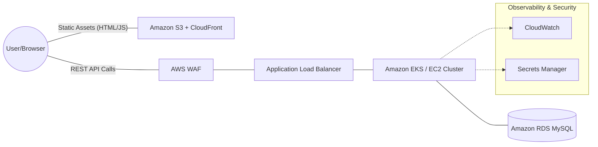
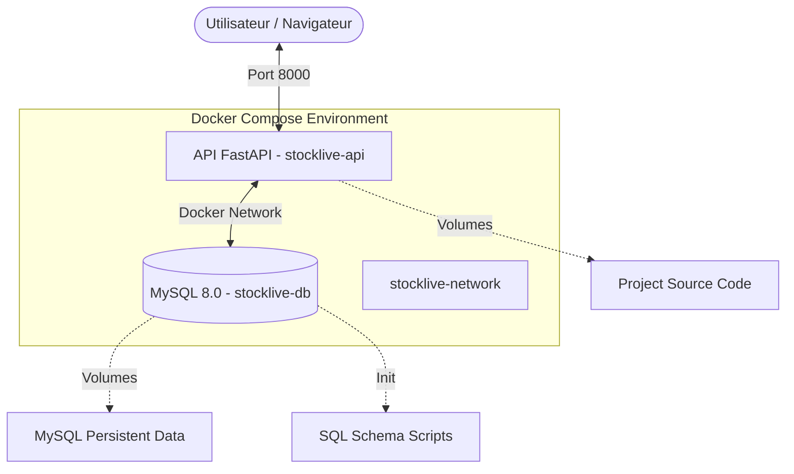
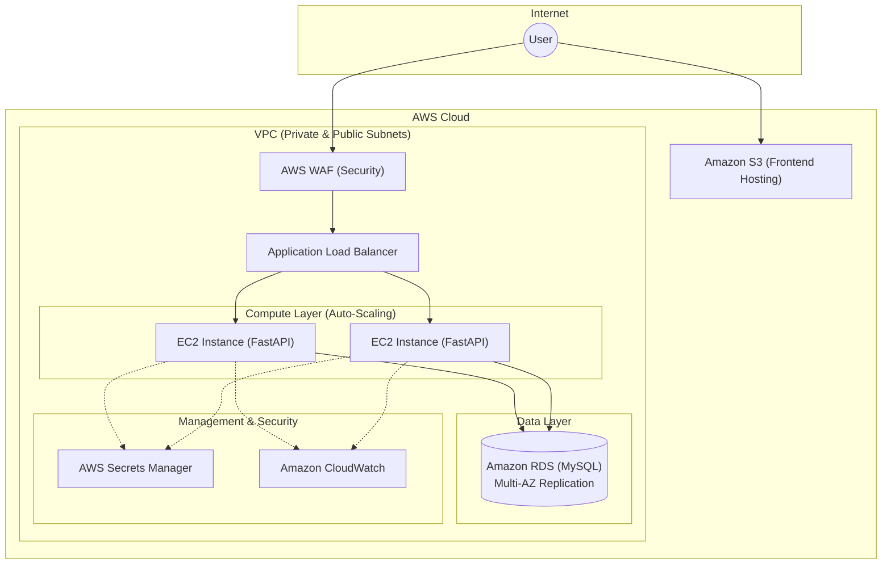

# 🏗️ StockLive - Architecture & Cloud Migration Strategy

This document provides a comprehensive overview of the **StockLive** system architecture, detailing the transition from a legacy on-premise setup to a modern, scalable, cloud-native infrastructure on AWS.

---

## 📋 Table of Contents
1. [Global Architecture Overview](#-global-architecture-overview)
2. [Phase 1: Containerization (Current State)](#-phase-1-containerization-current-state)
3. [Phase 2: AWS Cloud Infrastructure (Target State)](#-phase-2-aws-cloud-infrastructure-target-state)
4. [Technical Stack](#-technical-stack)
5. [Security & DevSecOps](#-security--devsecops)
6. [CI/CD Pipeline](#-cicd-pipeline)

---

## 🌐 Global Architecture Overview

StockLive is evolving from a monolithic on-premise application to a decoupled cloud-native solution. The migration focuses on **high availability**, **security**, and **automated scalability**.

---

## 🐳 Phase 1: Containerization (Current State)

The initial phase focused on standardizing the development and deployment environment using **Docker** and **Docker Compose**. This ensures that "it works on my machine" translates perfectly to "it works in production."

### Local Development Structure

### Key Service Metrics
| Service | Technology | Port (Internal/External) | Role |
| :--- | :--- | :--- | :--- |
| **Backend API** | Python 3.11 / FastAPI | `8000:8000` | Logic, Auth, CRUD |
| **Database** | MySQL 8.0 | `3306 (Internal)` | Relational Storage |
| **Frontend** | Vanilla JS / HTML | `Served by API` | Dashboard & UI |

---

## ☁️ Phase 2: AWS Cloud Infrastructure (Target State)

The target architecture leverages AWS managed services to ensure maximum uptime and security.

### Infrastructure Diagram

### Architecture Highlights:
- **High Availability**: Multi-AZ deployment for RDS and EC2 instances behind an ALB.
- **Security First**: Secrets are stored in **AWS Secrets Manager**, and the edge is protected by **AWS WAF**.
- **Decoupled Frontend**: The dashboard is hosted on S3 as a static site, reducing the load on the API.

---

## 🛠️ Technical Stack

- **Backend**: FastAPI (Python 3.11)
- **Database**: MySQL 8.0 / Amazon RDS
- **Infrastructure**: Terraform (IaC), Docker
- **Cloud**: Amazon Web Services (AWS)
- **CI/CD**: GitHub Actions
- **Security**: .env encryption, Non-root Docker users, AWS WAF

---

## 🔒 Security & DevSecOps

Recent improvements implemented to harden the system:
- **Secret Management**: Migration from hardcoded credentials to encrypted `.env` files (excluded from Git).
- **Network Isolation**: Database ports are no longer exposed to the host; all communication occurs within the internal Docker network.
- **Health Monitoring**: Docker healthchecks implemented to ensure service availability before API startup.
- **Infrastructure as Code**: Terraform used to version and automate the VPC and AWS environment.

---

## ☁️ Phase 2: AWS Cloud Infrastructure (Delivered via IaC)

The cloud infrastructure is now fully defined using **Terraform**, allowing for automated, reproducible deployments.

### Infrastructure Highlights:
- **VPC & Networking**: Custom VPC with 2 public subnets (ALB/EC2) and 2 private subnets (RDS).
- **Security Groups**: Granular traffic control (ALB allows HTTP, App allows ALB, DB allows App).
- **Database**: Multi-AZ **Amazon RDS (MySQL)** for high availability.
- **Compute**: EC2 instances with Docker-ready configuration.
- **Load Balancing**: **Application Load Balancer (ALB)** for traffic distribution and health monitoring.
- **State Management**: Remote S3 backend with DynamoDB locking for CI/CD consistency.

---

## 📊 Observability & Monitoring (BC03)

A complete monitoring stack has been implemented to ensure system health and performance visibility.

### Monitoring Architecture:
- **Prometheus**: Metrics collection from the FastAPI app and system nodes.
- **Grafana**: Visualization dashboard (admin/admin) on port 3000.
- **Node Exporter**: System-level metrics (CPU, Memory, Disk).
- **FastAPI Instrumentation**: Real-time application metrics (requests, latency, errors) via `prometheus-fastapi-instrumentator`.

---

## 🚀 CI/CD Pipeline

The project uses **GitHub Actions** for automated testing, security, and deployment.

1. **Lint & Test**: Unit tests and database migration validation.
2. **Docker Build**: Automated building of the `stocklive-api` image.
3. **Security Scan**: Real-time vulnerability scanning using **Trivy** (fails on HIGH/CRITICAL).
4. **Deploy**: Automated deployment to AWS via **Terraform Apply**.

---

## 🏁 Delivery Status Summary

| Component | Status | Implementation |
| :--- | :--- | :--- |
| **Containerization** | ✅ Delivered | Docker & Docker Compose |
| **Infrastructure (IaC)** | ✅ Delivered | Terraform (VPC, RDS, EC2, ALB, SG) |
| **CI/CD Pipeline** | ✅ Delivered | GitHub Actions + Trivy + TF Apply |
| **Supervision** | ✅ Delivered | Prometheus + Grafana + Node Exporter |
| **Security** | 🛡️ Hardened | Non-root users, SG isolation, Scan Trivy |

---

> [!IMPORTANT]
> This project now meets the requirements for BC01 (IaC & Cloud), BC02 (Containers & CI/CD), and BC03 (Supervision).
