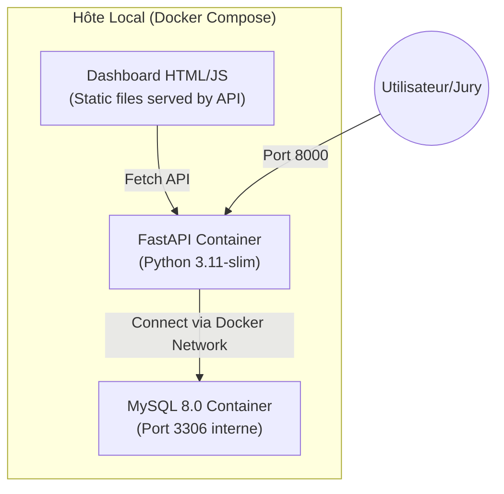
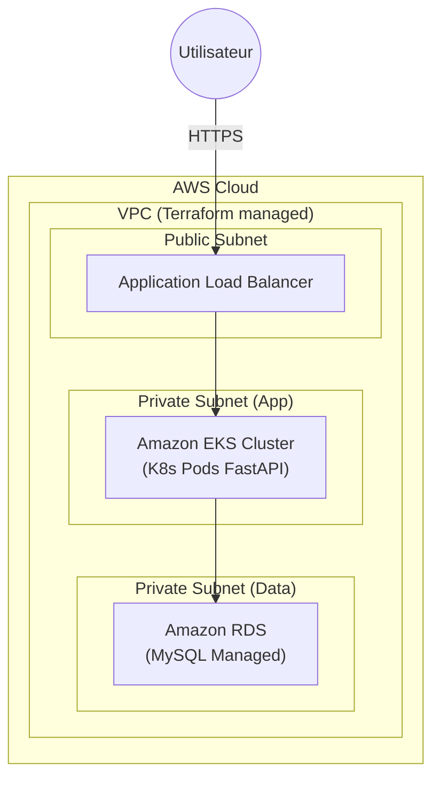

# Architecture de Migration Cloud-Native — StockLive

## État Actuel vs État Cible

### 1. Phase 1 : Migration Locale (Docker Compose)
*C'est l'étape que nous venons de finaliser et sécuriser.*

### 2. Phase 2 : Migration AWS (EKS + RDS)
*C'est la cible finale du projet.*

---

## Résumé des Actions Réalisées

Afin de répondre aux points bloquants du rapport du 09/04, les actions suivantes ont été effectuées sur la branche de travail actuelle :

### 1. Sécurité & Gestion des Secrets
- [x] **Création de `.env`** : Extraction des mots de passe en clair du `docker-compose.yml`.
- [x] **Création de `.env.example`** : Modèle fourni pour le repo.
- [x] **Mise à jour du `.gitignore`** : Exclusion de `.env`, `venv/`, `__pycache__/`, et `*.db`.
- [x] **Nettoyage Git** : Suppression du fichier binaire `ghu.db` et des dossiers `venv/`, `__pycache__` de l'index Git (`git rm --cached`).

### 2. Optimisation Docker Compose
- [x] **Suppression du mapping de port MySQL** : Le port `3307:3306` n'est plus exposé sur l'hôte, augmentant la sécurité.
- [x] **Ajout de Healthchecks** : MySQL dispose d'un test de santé (`mysqladmin ping`).
- [x] **Gestion des Dépendances** : L'API ne démarre que lorsque MySQL est `service_healthy`.
- [x] **Fiabilité** : Ajout de `restart: unless-stopped` sur tous les services.
- [x] **Modernisation** : Suppression de la mention obsolète `version: '3.8'`.

### 3. CI/CD & Infrastructure (Priorité BC01/BC02)
- [x] **Pipeline CI/CD** : Création de `.github/workflows/ci.yml` pour le build automatique et les tests de migration.
- [x] **Infrastructure as Code** : Création de `terraform/main.tf` avec la base du VPC AWS.

### 4. Ménage & Professionnalisme
- [x] **Suppression des scripts `tmp_*.py`** : Suppression des fichiers de debug pour un repo propre.

---

### Prochaines Étapes Suggérées
1. **Hardening du Dockerfile** : Passer sur un utilisateur non-root et implémenter le multi-stage build.
2. **Compléter Terraform** : Ajouter les subnets privés, les Security Groups et l'instance RDS.
3. **Ansible** : Automatiser la configuration post-déploiement ou locale si nécessaire.
