# Architecture Docker - StockLive

Voici une vue d'ensemble du déploiement Docker que nous venons de mettre en place.

## Structure du Système

```mermaid
graph TD
    User([Utilisateur / Navigateur]) <--> |Port 8000| API[API FastAPI - stocklive-api]
    API <--> |Réseau Interne: db| DB[(Base de Données - stocklive-db)]
    
    subgraph "Docker Compose"
        API
        DB
        Network[stocklive-network]
    end
    
    API -.-> |Volumes| HostCode[Dossier Projet]
    DB -.-> |Volumes| DBData[Volume MySQL Data]
    DB -.-> |Init| InitSQL[Dossier init_db]
```

## État des Services

| Service | Conteneur | Port Externe | Statut |
| :--- | :--- | :--- | :--- |
| **Backend API** | `stocklive-api` | `8000` | ✅ En ligne (Uvicorn) |
| **Base de Données** | `stocklive-db` | `3306` | ✅ En ligne (MySQL 8.0) |

## Commandes Utiles

- **Relancer le projet :** `docker-compose up --build -d`
- **Voir les logs de l'API :** `docker logs -f stocklive-api`
- **Arrêter tout :** `docker-compose down`

## Prochaines Étapes suggérées
> [!TIP]
> Maintenant que les conteneurs tournent :
> 1. Accédez à la documentation Swagger : [http://localhost:8000/docs](http://localhost:8000/docs)
> 2. Vérifiez que la connexion DB est OK via les logs.
> 3. Souhaitez-vous que j'automatise le script de création d'utilisateur dans Docker ?
